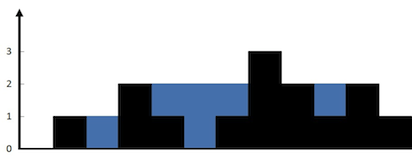

## 42. Trapping Rain Water
#### 1. 문제 파악

- 각 막대의 너비가 1인 고도 지도를 나타내는 음이 아닌 정수 n이 주어지면 
- 비가 내린 후 얼마나 많은 물을 가둘 수 있는지 계산한다.
#### 2. 재정의와 추상화
`height = [0, 1, 0, 2, 1, 0, 1, 3, 2, 1, 2, 1]`
-> 답은 6
#### 3. 계획 세우기
- 초기값 설정은 다음과 같다.
  - `answer = 0` 
  - 왼쪽, 오른쪽
    - `left = 0, right = length - 1`
  - 왼쪽에서의 최대값, 오른쪽에서의 최대값
    - `leftMax = height[left], rightMax = height[right]`
- 투포인터를 사용하여 왼쪽(lt), 오른쪽(rt)를 사용한다.
- left < right 일때까지 while 문 동작
  - 각각 최대값은 while 문 시작하자마자 최대값을 갱신한다.
- 왼쪽에서의 최대값, 오른쪽에서의 최대값을 비교한다.
- 만약, 왼쪽 최대값이 오른쪽 최대값보다 작거나 같으면,
  - `answer += 왼쪽에서의 최대값 - 왼쪽에서의 현재값`
  - `left++`
- 반대로 왼쪽 최대값이 오른쪽 최대값보다 크면,
  - `answer += 오른쪽에서의 최대값 - 오른쪽에서의 현재값`
  - `right--`
#### 4. 검증하기
#### 5. 계획 수행하기
- 코딩 실행

### 6. 회고
