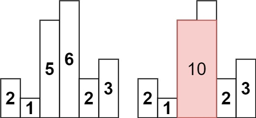

## 84. Largest Rectangle In Histogram
#### 1. 문제 파악
- 정수 높이 배열이 주어지며 여기서 heights[i]는 막대의 높이를 나타냅니다. 각 막대의 너비는 1입니다.
- 막대로 형성할 수 있는 가장 큰 직사각형의 면적을 반환합니다.
- 예시

#### 2. 재정의와 추상화
#### 3. 계획 세우기
- 스택을 활용해서 면적의 최대값을 구한다.
- 스택에 들어가는 값은 `[index, height]` 페어로 넣는다.
- for 문으로 배열을 탐색한다.
  - 인덱스를 start 로 / 값을 h 로 지정
  - 만약 스택이 비워져있지 않으면서 스택의 가장 마지막 값의 높이(height)가 h 보다 클때까지(`while`)
    - pop 하여 index, height 로 지정
    - height * (i - index)와 현재 최대값과 비교하여 최대값 갱신
    - start 는 index 로 갱신
  - start, h 로 스택에 push 한다.
- 최종적으로 stack 을 돌면서 (index, height)
  - `height * 배열 길이 - index`와 현재 최대값과 비교하여 최대값 갱신한다.
- 최대값을 리턴한다.
#### 4. 검증하기
#### 5. 계획 수행하기
- 코딩 실행

### 6. 회고

