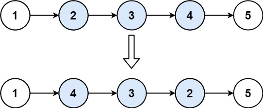
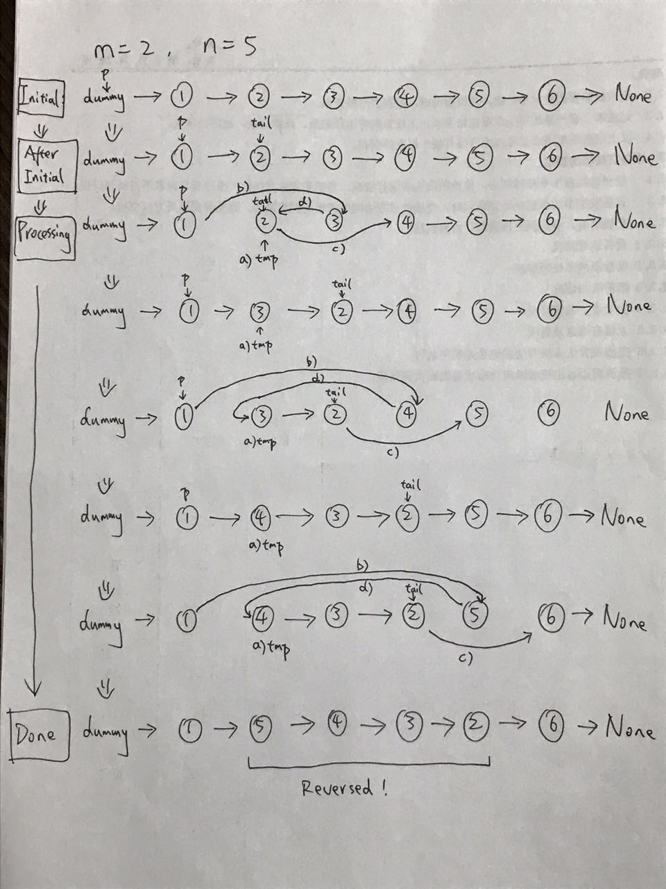

## 92. Reverse Linked List 2
#### 1. 문제 파악
- 단일 연결 리스트의 헤드와 `left <= right`인 경우 두 개의 정수 left 및 right가 주어지면 
- 리스트의 노드를 왼쪽 위치에서 오른쪽 위치로 반전시키고 반전된 리스트를 반환합니다.

#### 2. 재정의와 추상화
#### 3. 계획 세우기
- head가 null 이거나 `left === right`일 경우 head 를 반환
- 출발지와 끝지점을 정한다.(start, end)
- 출발지는 for loop 를 이용하여 next 로 출발지를 선택한다. 이동은 left - 1 만큼 이동한다.
- 끝지점은 start의 다음 지점을 선택한다.
- 여기서 right - left 차이 만큼 for loop 를 돈다.
  - 임시 노드를 start.next
  - 출발지 포인터는 끝지점 포인터로
  - 끝지점 포인터는 끝지점 포인터 포인터로
  - 출발지 포인터 포인터는 임시노드로 둔다.
- 마지막으로 root의 포인터를 반환한다.
#### 4. 검증하기
#### 5. 계획 수행하기
- 코딩 실행

### 6. 회고
- Solutions에서 찾은 그림으로 이해하는 문제 풀이

