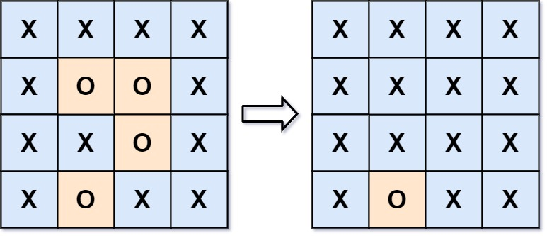

## 130. Surrounded Regions
#### 1. 문제 파악

- 주어진 이차원 배열(`m * n`)에서 `O`가 `X`로 네방향으로 둘러싸인다면 `X`로 뒤집는다.
#### 2. 재정의와 추상화
#### 3. 계획 세우기
- 완전 탐색을 사용하여 만약 `O`를 만나게 되면
- 다음 조건을 만족하는지 확인한다.
  - 행, 열 좌표가 0이거나
  - 행, 열 좌표가 행 끝, 열 끝 좌표이거나(`m - 1`, `n - 1`)
- 만족한다면 해당 좌표를 방문 표시하고(`visited`)
- dfs를 실행한다.
- dfs는 다음과 같다.
  - 4방향 돌면서
  - x, y 좌표가 0 이상
  - 맵 끝이 아니고
  - 방문 한적이 없으며(`visited`)
  - 좌표가 `O`가 있다면
- 해당 좌표를 방문표시하고 dfs 재귀호출한다.
- 이 부분을 모두 마쳤다면 다시 완전탐색하여
  - 해당 좌표가 `visited`로 되어 있다면 `O`
  - 아니라면 `X`로 표시한다.
#### 4. 검증하기
#### 5. 계획 수행하기
- 코딩 실행

### 6. 회고
