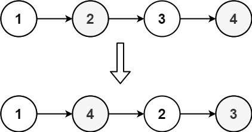

## 143. Reorder List
#### 1. 문제 파악
> L0 → L1 → … → Ln - 1 → Ln 
- 목록을 다음과 같은 형식으로 다시 정렬하세요. 
> L0 → Ln → L1 → Ln-1 → L2 → Ln-2 → …
- 목록의 노드에 있는 값은 수정할 수 없습니다. 노드 자체만 변경할 수 있습니다.

#### 예시

#### 2. 재정의와 추상화
#### 3. 계획 세우기
- 만약 head가 없거나 head의 next 가 없다면 바로 return
- 슬로우/패스트 포인터를 사용하여 중간 노드를 찾는다.
- 중간 이후의 노드를 뒤집는다.
  - 이전 노드(prev), 뒤집기 위한 임시 노드(temp)를 null 로 초기화, 현재 노드(cur)는 중간 노드(slow)로 할당한다.
  - while 문으로 현재 노드가 있을때 까지 반복하는데
  - 임시 노드는 현재 노드의 다음, 현재 노드의 다음은 이전 노드, 이전 노드는 현재 노드, 현재 노드는 임시 노드로 할당한다.
  - 즉, 뒤집는다.
- 두 리스트를 병합한다. 첫 번째 절반과 두 번째 절반 리스트를 번갈아가며 병합하는데
  - 첫 번째는 head, 두 번째는 이전 노드로 할당
  - while 문으로 두 번째 노드의 다음이 있는 동안 반복하는데
  - 임시 노드는 첫 번째 노드의 다음, 첫 번째 노드의 다음은 두 번째 노드, 첫 번째는 임시 노드로 연결
  - 임시 노드는 두 번째 노드의 다음, 두 번째 노드의 다음은 첫 번째 노드, 두 번째는 임시 노드로 연결
  - 이렇게 하면 번갈아 가며 병합이 가능하다.

#### 4. 검증하기
#### 5. 계획 수행하기
- 코딩 실행

### 6. 회고
