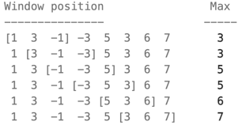

## 239. Sliding Window Maximum
#### 1. 문제 파악
- 정수 nums 배열이 주어지고, 배열의 맨 왼쪽에서 맨 오른쪽으로 이동하는 k 크기의 슬라이딩 윈도우가 있습니다. 
- 슬라이딩 윈도우가 오른쪽으로 한 위치씩 이동할 때마다, 윈도우에서 k개의 숫자만 볼 수 있습니다. 
- 윈도우 내 최대값을 전부 기록하여 리턴합니다.

- 답: [3,3,5,5,6,7]
#### 2. 재정의와 추상화
#### 3. 계획 세우기
- 윈도우를 갱신할 때마다 Math.max 을 사용하여 최대값을 갱신하면 시간복잡도에서 O(n^2)이 될 수 있다.
- 정수 배열 nums 의 길이 length 가 1이고 k가 1일 경우 그대로 nums 을 리턴한다.
- 정답 배열(`answer`)을 윈도우의 개수 만큼 만들고 0으로 미리 초기화 한다.
- 왼쪽 인덱스 0을 초기화
- 덱(q) 역할을 하는 q을 만든다. ([])
  - 여기서 맨 앞은 현재 인덱스의 최대값 인덱스가 위치하도록 한다.
- for 문을 돌면서 right 라는 인덱스 기준으로 nums 의 길이만큼 도는데
  - 만약 q가 비워져 있지 않고 right 인덱스 기준으 윈도우의 범위가 벗어난다면 (`q.at(0) < right - k + 1`)
    - 덱의 맨 앞 인덱스를 제거한다. (`q.shift()`)
  - while 문으로 덱의 뒤쪽에 있는 인덱스들이 현재 숫자(`nums[i]`)보다 작으면 제거한다.(`nums[q.at(-1)] < nums[right]`)
    - 더 작은 값들은 후보가 될 수 없기 때문에 제거한다. (`q.pop()`)
  - 오른쪽 인덱스를 덱에 추가한다. (`q.push()`)
  - 만약 오른쪽 인덱스가 윈도우의 끝에 도달하면(`right >= k - 1`) 결과에 현재 최대값 기록(`answer[left] = nums[q.at(0)]`)
    - 왼쪽 인덱스를 이동한다.
- 정답 배열을 리턴한다.
#### 5. 계획 수행하기
- 코딩 실행

### 6. 회고
- 이렇게 할 경우 자바스크립트의 shift, unshift 등의 내부 메서드는 연산이 O(n)이다.
- 그럴 경우 Deque를 사용하면 되는데 자바스크립트에선 Deque가 없으므로 head, tail 등을 사용하여 직접 구현해야한다.
```javascript
function maxSlidingWindow(nums, k) {
  const n = nums.length;
  if (n === 0) return [];
  if (k === 1) return nums;

  const result = [];
  // 덱 역할을 하는 배열을 선언하고, head와 tail 포인터를 관리합니다.
  const deque = new Array(n);
  let head = 0, tail = -1; // deque가 비어있는 상태

  for (let i = 0; i < n; i++) {
    // 1. 현재 윈도우 범위를 벗어난 인덱스 제거 (head를 증가)
    if (head <= tail && deque[head] < i - k + 1) {
      head++;
    }

    // 2. 덱의 뒤쪽에서 현재 값보다 작은 인덱스 제거
    while (head <= tail && nums[deque[tail]] < nums[i]) {
      tail--;
    }

    // 3. 현재 인덱스를 덱에 추가
    deque[++tail] = i;

    // 4. 윈도우가 완성되면 결과에 최대값 추가 (덱의 front 값)
    if (i >= k - 1) {
      result.push(nums[deque[head]]);
    }
  }
  return result;
}
```
- 알고리즘을 풀때마다 자바스크립트가 알고리즘 풀기로는 끔찍하다는걸 느낄 수 있다.
