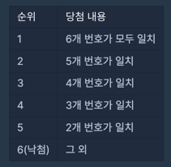

## 다트게임
#### 1. 문제 파악
- 로또 는 6/45 로 1부터 45까지의 숫자 중 6개를 찍어서 맞히는 복권(순위는 아래 사진과 같다.)

- 알아볼 수 없는 번호를 0으로 표기 하고, 자신이 구매했던 로또로 당첨이 가능했던 최고 순위와 최저 순위를 알아보자
- 순서와 상관없이, 구매한 로또에 당첨 번호와 일치하는 번호가 있으면 맞힌 걸로 인정.
- 로또 번호를 담은 배열 `lottos`, 당첨 번호를 담은 배열 `win_nums`가 매개변수로 주어진다. 
- 당첨 가능한 최고 순위와 최저 순위를 차례대로 배열에 담아서 return 하도록 solution 함수를 완성하기

**제한사항**
- lottos는 길이 6인 정수 배열입니다. 
- lottos의 모든 원소는 0 이상 45 이하인 정수입니다. 
  - 0은 알아볼 수 없는 숫자를 의미합니다. 
  - 0을 제외한 다른 숫자들은 lottos에 2개 이상 담겨있지 않습니다.
  - lottos의 원소들은 정렬되어 있지 않을 수도 있습니다.
- win_nums은 길이 6인 정수 배열입니다.
- win_nums의 모든 원소는 1 이상 45 이하인 정수입니다.
  - win_nums에는 같은 숫자가 2개 이상 담겨있지 않습니다.
  - win_nums의 원소들은 정렬되어 있지 않을 수도 있습니다.

#### 2. 재정의와 추상화
#### 3. 계획 세우기
- 로또 당첨 보드 부터 맵(객체)로 만든다.
- 당첨 번호를 Set 에 담는다.
- 알아볼 수 없는 번호 카운트 zeroCount, 당첨 카운트 winCount 로 초기화한다.
- for 문을 돌면서 `lottos`의 번호를 확인하는데
  - 만약 `0`이라면 zeroCount 에 +1
  - 당첨 되었다면 winCount 에 +1
- 리턴시 배열로 `board[winCount + zeroCount]`, `board[winCount]`를 리턴한다.
#### 4. 검증하기
#### 5. 계획 수행하기
- 코딩 실행

### 6. 회고
