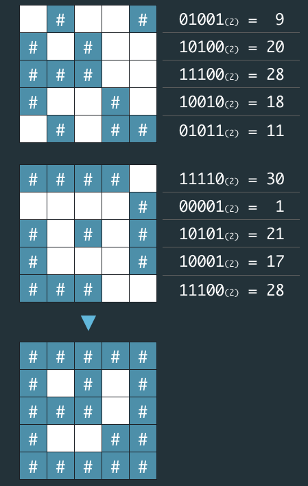

## 비밀지도
#### 1. 문제 파악
- 지도는 한 변의 길이가 n인 정사각형 배열 형태로, 각 칸은 "공백"(" ") 또는 "벽"("#") 두 종류로 이루어져 있다.
- 전체 지도는 두 장의 지도를 겹쳐서 얻을 수 있다. 
- 각각 "지도 1"과 "지도 2"라고 하자. 지도 1 또는 지도 2 중 어느 하나라도 벽인 부분은 전체 지도에서도 벽이다. 
- 지도 1과 지도 2에서 모두 공백인 부분은 전체 지도에서도 공백이다.
- "지도 1"과 "지도 2"는 각각 정수 배열로 암호화되어 있다.
- 암호화된 배열은 지도의 각 가로줄에서 벽 부분을 1, 공백 부분을 0으로 부호화했을 때 얻어지는 이진수에 해당하는 값의 배열이다.

- '#', 공백으로 구성된 문자열 배열로 출력하라.
#### 2. 재정의와 추상화
- 1 <= n <= 16
- 정수 배열의 각 원소 x를 이진수로 변환했을 때의 길이는 n 이하이다. 즉, `0 ≦ x ≦ 2n - 1`을 만족한다.

#### 3. 계획 세우기
- 지도1과 지도2에서 각 배열의 원소를 겹쳤을 때 전부 0일 경우에만 공백처리를 한다.
  - 즉, 컴퓨터 계산식으로 하나만 참(1)이면 참으로 적용한다. -> `OR` 연산을 활용한다.
  - `OR` 연산은 숫자 단위로 진행되므로 이진수로 변환된 문자열을 OR 연산할 필요 없이, 숫자 자체에 `|` 연산자를 사용하면 된다.
  - 연산을 마쳤다면 1은 `#`, 0은 ` `(공백) 하여 문자열로 변경한다.
  - 해당 문자열은 answer 배열에 추가한다.
- 주의할 점
  - 만약 연산한 이진수의 길이가 n 이하라면 0을 맨 앞에 추가하여 지도의 길이를 맞춘다.
#### 4. 검증하기
#### 5. 계획 수행하기
- 코딩 실행

### 6. 회고
