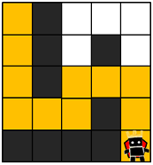
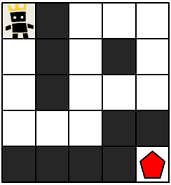

## 게임 맵 최단거리
#### 1. 문제 파악
##### 그림

- maps가 매개변수로 주어질 때, 캐릭터가 상대 팀 진영에 도착하기 위해서 지나가야 하는 칸의 개수의 최솟값을 return 하도록 solution 함수를 완성해주세요. 
- 단, 상대 팀 진영에 도착할 수 없을 때는 -1을 return 해주세요.
- maps는 0과 1로만 이루어져 있으며, 0은 벽이 있는 자리, 1은 벽이 없는 자리를 나타냅니다.
#### 2. 재정의와 추상화
#### 3. 계획 세우기
- 탐색문제로 도착 점까지 최솟값을 구하기 때문에 너비 우선 탐색인 BFS를 활용한다.
- BFS 함수는 다음과 같다.
  - queue로 사용할 배열을 생성하고 캐릭터의 x, y 로 이동할 좌표 배열을 만든다. (`[0, 1, 0, -1]`, `[1, 0, -1, 0]`)
  - queue에서 좌표를 뽑고 거기서 다시 상하 좌우 확인하고 만약 벽이 없는 자리(`=== 1`)라면 queue에 넣는다. (`unshift()`)
  - 방문했기 때문에 해당 칸은 0으로 처리하고 거리 + 1을 한다.(`distance + 1`)
  - 그리고 만약 적팀 진영 칸에 도착한다면 해당 값을 리턴한다.
- BFS가 돌았음에도 진영 칸에 도착하지 못했다면 `-1`을 리턴한다.
#### 4. 검증하기
#### 5. 계획 수행하기
- 코딩 실행

### 6. 회고
