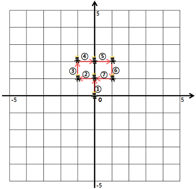
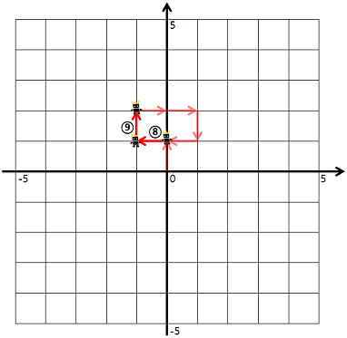
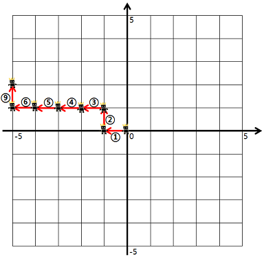

## 방문 길이
#### 1. 문제 파악
- L / R / U / D 상하좌우 방향으로 한칸씩 이동하는 명령어가 있다.
- 좌표평면의 최대치는 상하좌우 방향으로 5칸씩밖에 없음
- 명령어는 문자열로 예로들면 "ULURRDLLU"로 명령한다.
- 명령시 캐릭터가 이동하는데 캐릭터가 처음 걸어본 길의 길이를 구하려고 한다.


- 이 것처럼 8, 9번 명령에서 움직인 2, 3번 명령어에서 이미 지나간 길이라 세지않음.
- 좌표평면의 경계를 넘어가는 명령어는 무시한다.

- dirs는 string형으로 주어지며, 'U', 'D', 'R', 'L' 이외에 문자는 주어지지 않습니다. 
- dirs의 길이는 500 이하의 자연수
#### 2. 재정의와 추상화
#### 3. 계획 세우기
- 먼저 해당 문자별(상하좌우) 움직임을 파악하는 객체 및 map을 만든다.
  - `const move = { L: [-1, 0], R: [1, 0], U: [0, 1], D: [0, -1] }`
- 현재 캐릭터 위치를 초기화 한다. (`[0, 0]`)
- 이미 지나간길을 체크하는 Set 컬렉션을 사용한다.
- for 문을 돌면서 각 명령어대로 움직인다.
  - 명령어를 받아 x, y 좌표대로 이동한다.
```javascript
let nx = now[0] + move[dir][0];
let ny = now[1] + move[dir][1];
```
  - 만약 nx, ny가 좌표평면의 경계를 넘어간다면 `continue`로 무시한다.
  - 지나간 길을 체크하는 Set 컬렉션에 추가하는데, 반대방향에서도 해당길을 사용할 수 있기 때문에 현재 위치, 다음 위치의 방향을 바꿔서 동시에 추가한다.
```javascript
visited.add(`${now[0]}, ${now[1]} -> ${nx}, ${ny}`);
visited.add(`${nx}, ${ny} -> ${now[0]}, ${now[1]}`);
```
  - 추가했다면 현재위치를 다음 위치로 변경한다. (`now = [nx, ny]`)
- 명령어가 끝나면 Set 컬렉션의 크기를 반으로 나누고 리턴한다.(반으로 나눈 이유는 왕복으로 넣었기 때문)
#### 4. 검증하기
#### 5. 계획 수행하기
- 코딩 실행

### 6. 회고
