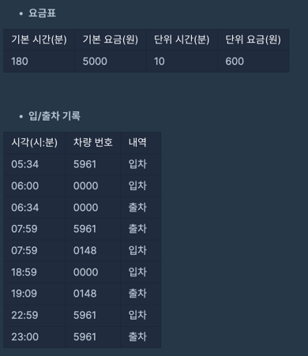

## 주차 요금 계산
#### 1. 문제 파악
- 차량별로 주차 요금을 계산하려고 한다.

- 어떤 차량이 입차된 후에 출차된 내역이 없다면, 23:59에 출차된 것으로 간주합니다.
- 00:00부터 23:59까지의 입/출차 내역을 바탕으로 차량별 누적 주차 시간을 계산하여 요금을 일괄로 정산합니다.
- 누적 주차 시간이 기본 시간이하라면, 기본 요금을 청구합니다.
- 누적 주차 시간이 기본 시간을 초과하면, 기본 요금에 더해서, 초과한 시간에 대해서 단위 시간 마다 단위 요금을 청구합니다.
- 초과한 시간이 단위 시간으로 나누어 떨어지지 않으면, `올림`합니다.
- `⌈a⌉` : a보다 작지 않은 최소의 정수를 의미합니다. 즉, `올림`을 의미합니다.
- 주차 요금을 나타내는 정수 배열 fees, 자동차의 입/출차 내역을 나타내는 문자열 배열 records가 매개변수로 주어집니다. 
- 차량 번호가 작은 자동차부터 청구할 주차 요금을 차례대로 정수 배열에 담아서 return 할 것
---
- 제한사항

#### 2. 재정의와 추상화
#### 3. 계획 세우기
- 구현문제로 차량의 출입부터 확인하면서 진행한다.
- 자동차별 기록을 하기위해 객체로 생성하고(`cars`)
- `records` 를 for 문으로 확인하는데
  - split 으로 `시간(time), 자동차(car), 입출입상태(parkingStatus)`로 나누고
  - time 을 다시 `split(":")` 으로 나누어 `시간(hour), 분(minute)`으로 나누고, 주차비는 분당으로 계산하기 때문에 hour * 60 + minute을 한다.
  - 만약 `cars`에서 해당 car가 없다면 `{car, time: 0, lastInTime(마지막으로 들어온 시간): 0}`으로 추가한다.
  - `parkingStatus`를 갱신하고, 
    - 만약 `parkingStatus`가 "OUT" 이면 time 에 time - lastInTime 한 값을 추가한다.
    - "IN" 이면 lastInTime 에 time 으로 할당한다.
- 요금 계산을 진행한다.
  - sort 로 차량 번호 순대로 정렬하고
  - 만약, 차량의 `parkingStatus`가 "IN" 이라면, time 에 1439 - lastInTime 한 값을 더한다.
  - 만약, time 이 기본시간보다 같거나 작다면, 기본요금인 fee[1] 로 한다.
  - 그외 계산할 때 기본요금 + 추가요금: (올림값((시간 - 기본시간) / 단위 시간) + 단위 요금)을 한 값으로 할당한다.
#### 4. 검증하기
#### 5. 계획 수행하기
- 코딩 실행

### 6. 회고
