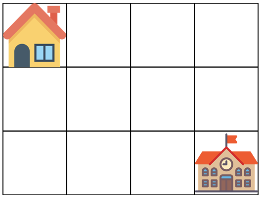

## 등굣길
#### 1. 문제 파악

- 가장 왼쪽 위, 즉 집이 있는 곳의 좌표는 (1, 1)로 나타내고 가장 오른쪽 아래, 즉 학교가 있는 곳의 좌표는 (m, n)으로 나타냅니다.
- 격자의 크기 m, n과 물이 잠긴 지역의 좌표를 담은 2차원 배열 puddles이 매개변수로 주어집니다. 
- 오른쪽과 아래쪽으로만 움직여 집에서 학교까지 갈 수 있는 최단경로의 개수를 
- 1,000,000,007로 나눈 나머지를 return 하도록 solution 함수를 작성해주세요.

제한사항
- 격자의 크기 m, n은 1 이상 100 이하인 자연수입니다.
- m과 n이 모두 1인 경우는 입력으로 주어지지 않습니다.
- 물에 잠긴 지역은 0개 이상 10개 이하입니다.
- 집과 학교가 물에 잠긴 경우는 입력으로 주어지지 않습니다.
#### 2. 재정의와 추상화
#### 3. 계획 세우기
- 이동하는 수가 오른쪽, 아래 밖에 없기 때문에 도착한 칸의 왼쪽 칸, 위쪽 칸에서 오는 경로 수의 합으로 나타낼 수 있다.
  - (x, y) 위치까지의 경로 수를 구하는 작은 문제로 분해할 수 있고, 그게 반복된다.
- DP(Dynamic Programming)으로 풀 수 있으며, 점화식은 다음과 같다.
  - `dp[x][y] = dp[x - 1][y] + dp[x][y - 1]`
- 다만 여기서 주의할 점은 물웅덩이를 만나면 지나갈 수 없다. 그래서 물웅덩이를 만났을 경우와 함께 메모리를 할당한다.
```javascript
const dp = Array.from({length: n + 1}, () => Array(m + 1).fill(0));
const isPuddle = Array.from({length: n + 1}, () => Array(m + 1).fill(false));
for (const [x, y] of puddles) {
  isPuddle[y][x] = true;
}
```
- 여기서 n + 1, m + 1 을 하는 이유는 시작 지점이 (1, 1) 이기 때문에 편의상 각각 + 1을 한다.
- 물웅덩이 체크까지 완료했다면, `dp[1][1] = 1`로 시작점 초기화 한다.
- for 문을 돌면서 dp 점화식을 동작하는데
  - 만약 시작점이라면 점화식을 지나친다.(`row === 1 && col === 1`) => `continue`
  - 만약 물웅덩이라면 해당 지점을 0으로 쳐리한다.
  - 그렇지 않다면 점화식을 적용한다.(`dp[x][y] = (dp[x - 1][y] + dp[x][y - 1]) % 1_000_000_007`)
- 도착점인 `dp[n][m]`을 리턴한다.
#### 4. 검증하기
#### 5. 계획 수행하기
- 코딩 실행

### 6. 회고
- 자바스크립트에서 이차배열로 `Array`로 초기화하면 주의할 점이 있다.
```javascript
// 잘못된 예시:
const dp = new Array(n + 1).fill(new Array(m+1).fill(0));
// 올바른 예시:
const dp = new Array(n + 1).fill(null).map(() => new Array(m + 1).fill(0));
```
- 바로 fill로 배열을 생성하면 `dp[0], dp[1]` 등이 전부 같은 배열을 참조하게 되어 모든 행이 바뀔 수도 있다.
- 그래서 따로 fill을 채워줘야하고 그다음에 new Array 로 생성해야한다.
- 귀찮기 때문에 이차배열을 초기화 한다면 `Array.from`으로 딱 한줄로 초기화가 가능하다.
```javascript
const dp = Array.from({ length: n + 1 }, () => Array(m + 1).fill(0));
```
