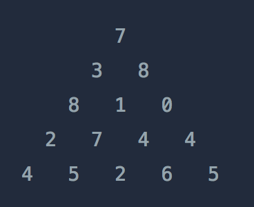

## 정수 삼각형
#### 1. 문제 파악

- 위와 같은 삼각형의 꼭대기에서 바닥까지 이어지는 경로 중, 거쳐간 숫자의 합이 가장 큰 경우를 찾아보려고 합니다. 
- 아래 칸으로 이동할 때는 대각선 방향으로 한 칸 오른쪽 또는 왼쪽으로만 이동 가능합니다. 
- 예를 들어 3에서는 그 아래칸의 8 또는 1로만 이동이 가능합니다. 
- 삼각형의 정보가 담긴 배열 triangle이 매개변수로 주어질 때, 거쳐간 숫자의 최댓값을 return 하도록 solution 함수를 완성하세요.
#### 2. 재정의와 추상화
#### 3. 계획 세우기
- 말이 삼각형이지 실제론 2차배열이다.
```javascript
[
  [0, 0],
  [1, 0], [1, 1],
  [2, 0], [2, 1], [2, 2],
  [3, 0], [3, 1], [3, 2], [3, 3],
  [4, 0], [4, 1], [4, 2], [4, 3], [4, 4],
]
```
- 만약 삼각형 배열의 길이가 1이라면 하나밖에 없다는 뜻이므로 첫번째 값을 바로 리턴한다.
- 2중 for 문을 돌면서 col, row로 진행한다.
  - 해당 배열의 값을 이전 값에 더하면서 진행한다.
  - 만약, col이 0 즉, 첫번째 값이라면 이런식으로 더한다.(`[row - 1][col]`)
  - 만약, col과 row가 같다면 즉, 가장 마지막 값이라면 이런식으로 더한다. (`[row - 1][col - 1]`)
  - 그 외의 값은 둘 중 최대값으로 결정한다. (`Math.max([row - 1][col - 1], [row - 1][col]`))
  - 위 조건이 진행할 때마다 answer 값의 최대값을 결정한다. (`Math.max(answer, [row][col]`))
- for 문을 마치면 answer 값을 리턴한다.
#### 4. 검증하기
#### 5. 계획 수행하기
- 코딩 실행

### 6. 회고
- reduce를 활용하여 좀 더 간단하게 처리를 할 수 있다.
```javascript
function solution2(triangle) {
  return Math.max(...triangle.reduce((cost, line) => {
    return line.map((v, index) => {
      return v + Math.max((index < cost.length ? cost[index] : 0), (index > 0 ? cost[index - 1] : 0));
    });
  }, []));
}

```
